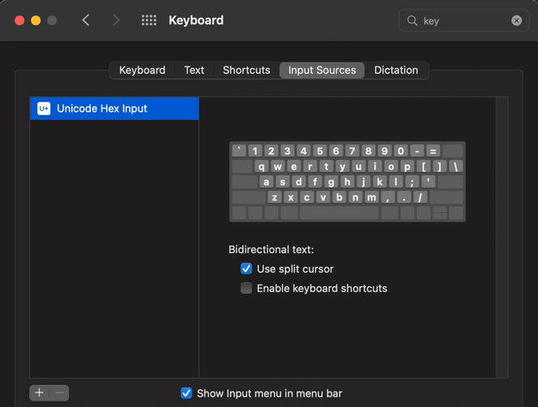
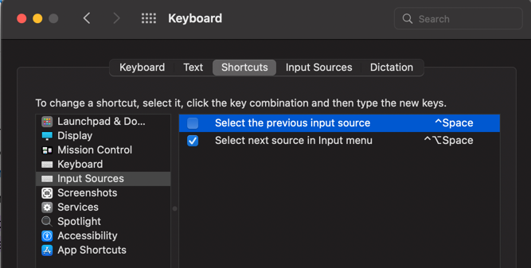

# lambo-setup-public
My mac setup: brew installs, zsh setup, etc.

# Steps
1. Run `setup1.sh` script remotely:
```bash
/bin/bash -c "$(curl -fsSL https://raw.githubusercontent.com/shane-lamb/lambo-setup-public/HEAD/setup1.sh)"
```
2. Run `setup2.sh` locally once the repo has been cloned.

# IntelliJ
## Sync settings and plugins
Use "settings sync" you can sync settings with your Jetbrains account - this is the simplest and best solution available right now:
https://www.jetbrains.com/help/idea/sharing-your-ide-settings.html#IDE_settings_sync

Note: It won't work with community edition, you need Ultimate.

## Some cool plugins
- Darcula Darker Theme
- IdeaVim + IdeaVim-Quickscope

# Stuff
I needed to set my input source as "Unicode Hex Input" so that I could use the `Alt` key on my keyboard:


`Ctrl+space` is reserved as an OS shortcut by default, you'll need to go and disable this so you can use it for completion in your IDE:


To invert scrolling direction, go to `Settings > Trackpad > Scroll & Zoom > Natural Scrolling`
